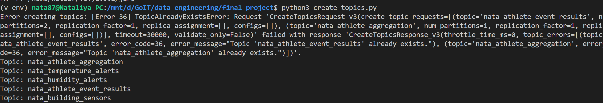
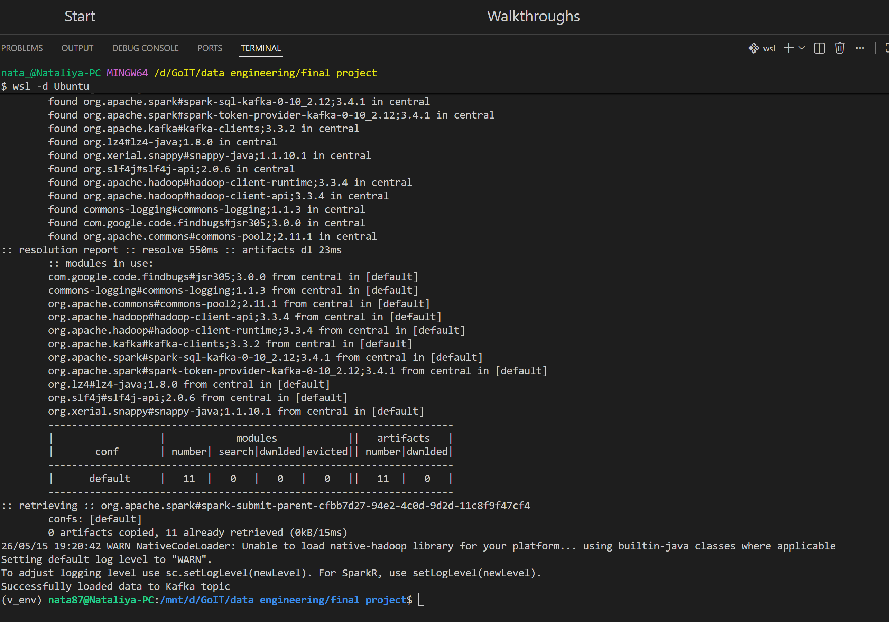
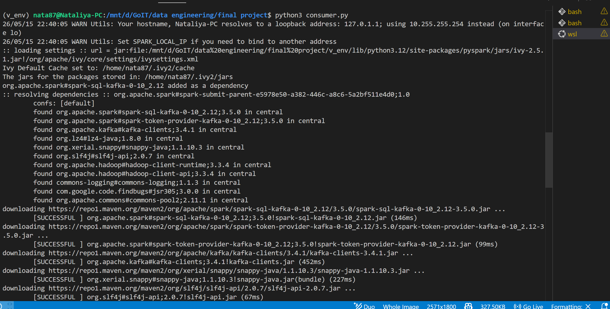
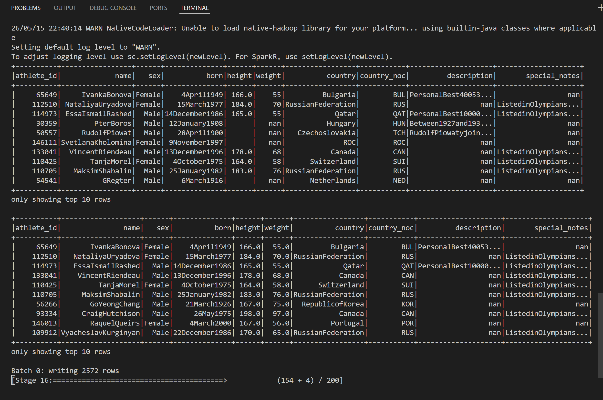
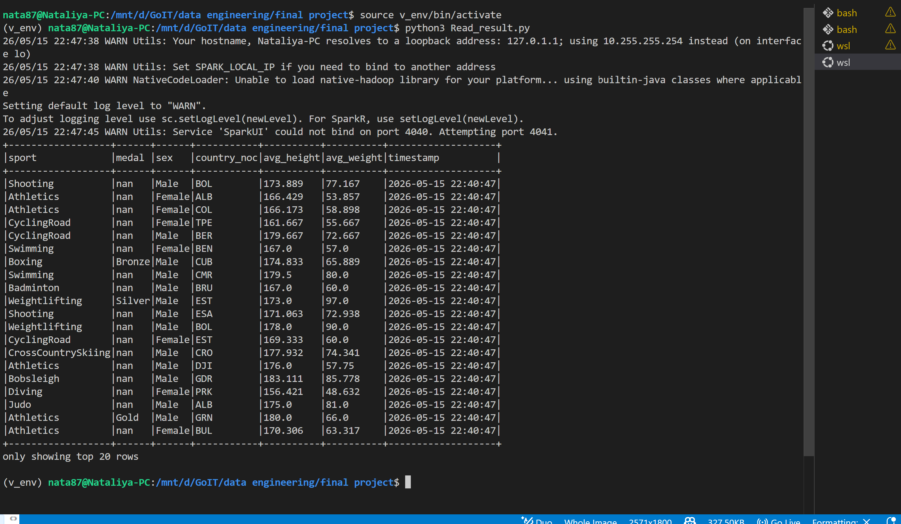
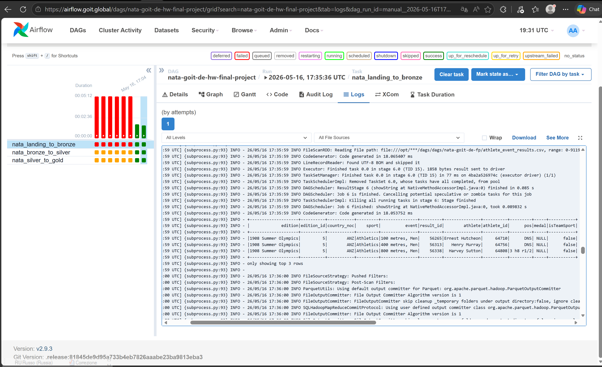
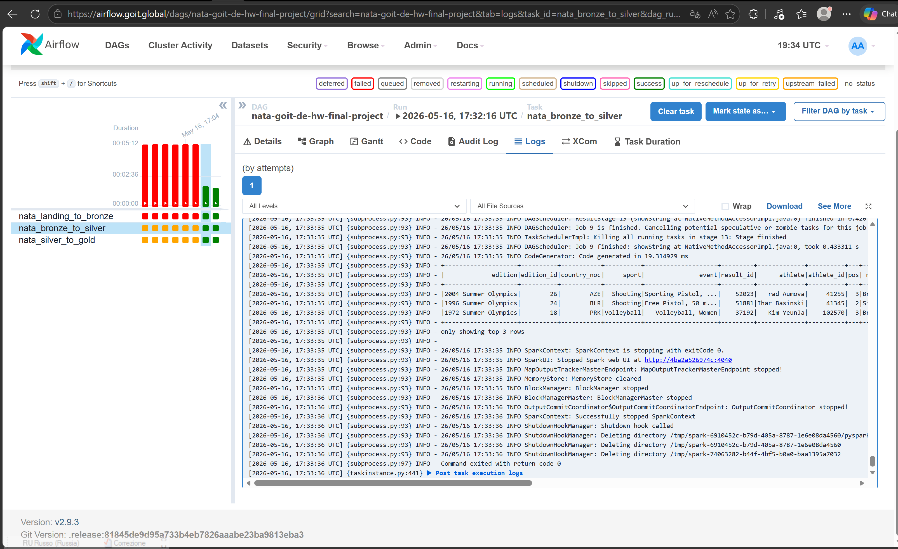
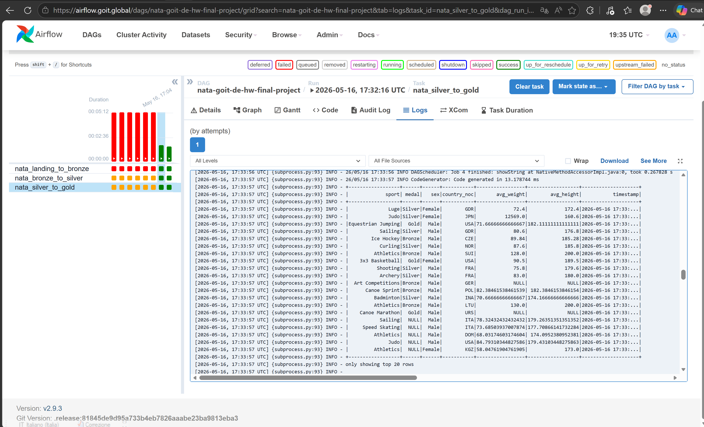
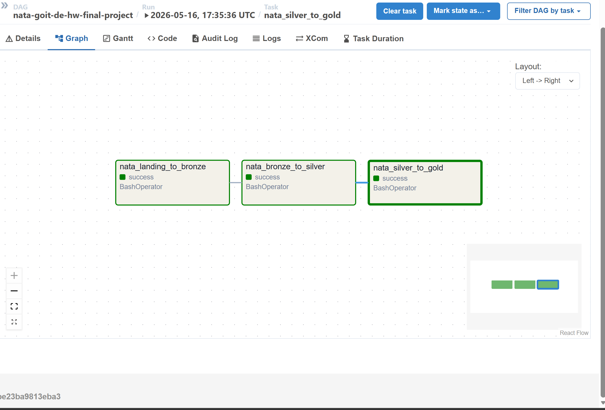

# Фінальний проект : Building an End-to-End Streaming Pipeline

## Етапи виконання проєкту (Part 1)

### 1. Створення інфраструктури топіків
Першим кроком було налаштування Kafka та створення топіків для вхідних подій (`nata_athlete_event_results`) та результуючих даних




### 2. Завантаження даних у потік (Producer)
Скрипт `producer.py` зчитує сирі дані результатів змагань з бази MySQL та транслює їх у Kafka для подальшої обробки



### 3. Стрімінгова обробка та збагачення (Consumer)
Основна логіка реалізована в `consumer.py`. Spark зчитує потік із Kafka, об'єднує його (Join) зі статичною таблицею `athlete_bio` з MySQL та розраховує середні показники (зріст, вага) для різних категорій



### 4. Збереження та перевірка результатів
Агреговані дані зберігаються у результуючу таблицю MySQL для подальшого аналізу



### 4. Фінальний етап 
Зчитування оброблених даних за допомогою `read_results.py` для перевірки коректності розрахунків



---

## Інструкція із запуску

1. **Активувати оточення:**
```bash
source v_env/bin/activate
```

Створити топіки: 
```bash
python3 create_topics.py
```

Запустити продюсер: 
```bash
python3 producer.py
```

Запустити консюмер: 
```bash
python3 consumer.py
```

Перевірити результат: 
```bash
python3 read_results.py
```


# # Final Project — Part 2: Building a Batch Data Lake

## ## Опис проєкту

Цей проєкт присвячений побудові пакетного даталейку (Batch Data Lake) за допомогою трирівневої архітектури **Medallion (Multi-hop) Architecture**: від початкового завантаження сирих даних до формування готових аналітичних вітрин.

Вся обробка, очищення та агрегація даних виконуються за допомогою **Apache Spark**, а оркестрація та послідовний запуск ETL-процесів автоматизовані через **Apache Airflow** в хмарному середовищі Sandbox.

---

## ## Архітектура Data Lake (Medallion Structure)

Проєкт реалізує класичний multi-hop підхід до обробки даних про атлетів та їхні спортивні результати (`athlete_bio` та `athlete_event_results`):

1. **Landing Zone / Bronze Layer**:
Автоматичне завантаження оригінальних файлів у форматі CSV з FTP-сервера за допомогою бібліотеки `requests`. Spark зчитує ці файли та конвертує їх у високоефективний колоночний формат **Parquet** без змін структури.
2. **Silver Layer**:
Етап очищення та стандартизації. Текстові колонки очищаються від спецсимволів за допомогою користувацької функції Spark (**UDF**). На цьому етапі також виконується **обов'язкова дедублікація рядків** для забезпечення якості даних.
3. **Gold Layer**:
Аналітичний рівень. Виконується приведення типів метрик (вага, ріст) до чисельних значень (`DoubleType`), об'єднання таблиць (Inner Join) за ідентифікатором атлета та розрахунок середніх показників ваги й росту для кожної комбінації `sport`, `medal`, `sex` та `country_noc`. Кожен рядок маркується поточним часовим штампом (`timestamp`).

---

## ## Опис Airflow DAG (`project_solution.py`)

Для забезпечення максимальної стабільності та уникнення проблем з відносними шляхами в Sandbox, замість стандартного оператора `SparkSubmitOperator`, запуск Spark-завдань реалізовано через **`BashOperator`**. Він ініціює прямі консольні команди `spark-submit` з точним динамічним абсолютним розташуванням скриптів на сервері.

### ### Параметри DAG:

* **DAG ID**: `nata-goit-de-hw-final-project`
* **Schedule**: `None` (запуск вручну або за тригером)
* **Послідовність виконання тасок**:
`nata_landing_to_bronze` ──> `nata_bronze_to_silver` ──> `nata_silver_to_gold`

---
## ## Результати виконання пайплайну

### 1 Логування та консольний вивід Spark
ETL-пайплайн послідовно автоматизує весь життєвий цикл даних: спочатку скрипт landing_to_bronze скачує сирі CSV-файли з FTP-сервера та конвертує їх у формат Parquet, потім bronze_to_silver очищає текст від технічного сміття за допомогою UDF та повністю видаляє дублікати рядків, і наприкінці silver_to_gold кастить типи даних, об'єднує таблиці й розраховує фінальну аналітичну вітрину з середніми показниками ваги та росту атлетів.





### 2. Успішний запуск та виконання DAG

Усі три етапи обробки даних (`landing_to_bronze`, `bronze_to_silver`, `silver_to_gold`)



---